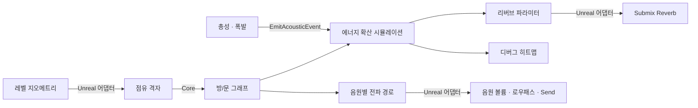

# Organic Reverb System

**공간을 시뮬레이션해서 리버브를 도출하는 실시간 음향 시스템** — Unreal Engine 5.8 · C++17

프리셋 리버브를 구역마다 바꿔 끼우는 대신, 레벨의 방 구조(크기, 재질, 문)를 자동으로 분석하고 방 사이를 흐르는 음향 에너지를 물리 모델로 계산해서 리버브 파라미터를 실시간으로 만든다. 알고리즘 본체는 엔진에 의존하지 않는 순수 C++로 작성했고, Unreal은 입출력 어댑터로만 붙어 있다.

> 게임 오디오 포트폴리오 프로젝트 · 1~6단계 완료, 다음은 7단계 포트폴리오 문서화 — [진행 상황](#7-진행-상황)

---

## 목차

1. [왜 만들었나](#1-왜-만들었나)
2. [알아야 할 최소한의 음향 지식](#2-알아야-할-최소한의-음향-지식)
3. [설계 요약](#3-설계-요약)
4. [프로토타입에서 배운 것](#4-프로토타입에서-배운-것)
5. [저장소 구조](#5-저장소-구조)
6. [빌드와 실행](#6-빌드와-실행)
7. [진행 상황](#7-진행-상황)
8. [문서](#8-문서)
9. [참고 자료](#9-참고-자료)

---

## 1. 왜 만들었나

### 언리얼 기본 오디오는 어디까지 하나
UE가 기본으로 제공하는 공간 표현은 세 가지다.

| 기능 | 하는 일 | 값을 정하는 주체 |
|---|---|---|
| Audio Volume + Reverb Effect | 구역에 들어가면 그 프리셋으로 페이드 | 디자이너가 Decay Time 등을 직접 입력 |
| Attenuation의 Occlusion | 리스너↔음원 사이로 **레이캐스트 한 발** → 막히면 로우패스 + 볼륨 감쇠 | 디자이너가 감쇠량을 직접 입력 |
| Audio Volume Interior Settings | 음원이 구역 밖이면 볼륨/로우패스를 정해진 만큼 줄임 | 디자이너가 직접 입력 |

전부 잘 동작하고 비용도 거의 0이다. 다만 공통점이 있다. **값을 사람이 정하고, 판정이 "구역 안이냐 밖이냐" · "막혔냐 안 막혔냐"의 이분법**이다. 공간의 크기나 재질, 옆 공간의 존재는 계산에 들어가지 않는다.

### 그래서 실제와 어떻게 달라지나
같은 상황을 넷으로 놓고 비교하면 차이가 분명하다.

| 상황 | 실제로는 | UE 기본 | 이 시스템 |
|---|---|---|---|
| **옆방 문이 열린다** | 옆 공간의 울림이 섞여 들어오기 시작한다 | 리버브는 그대로. Occlusion 레이가 뚫리면 로우패스만 풀린다 | 문이 열린 만큼 에너지가 실제로 오가기 시작한다 |
| **좁은 옷장에서 총을 쏜다** | 짧게 확 줄었다가, 문 너머 홀로 나갔던 소리가 돌아와 긴 꼬리를 남긴다 | 옷장 프리셋 하나뿐. 홀의 정보가 아예 없다 | 옷장 0.3초 → 홀 9.5초, **이중 기울기가 저절로 나온다** |
| **벽 너머에서 누가 걷는다** | 열린 문이 있으면 **문 쪽에서** 들린다 | 벽 뒤 음원 위치에서 먹먹하게 들린다 | 문을 돌아오는 경로를 찾아 문 쪽에서, 꺾인 각도만큼 깎여 들린다 |
| **50 m 밖에서 총성** | 늦게 도착하고, 고음이 빠지고, 직접음보다 울림이 커진다 | 거리 커브대로 즉시 작게 들린다 | 도착 지연 0.14초, 로우패스 4 kHz, "탕"이 "쿠웅"으로 바뀐다 |

차이의 뿌리는 하나다.

> **UE는 "리스너가 어느 구역에 있나"를 보고, 이 시스템은 "소리 에너지가 지금 어디에 얼마나 있나"를 본다.**

구역 방식은 경계에서 값을 시간으로 섞을 수밖에 없고, 그 보간에는 물리적 의미가 없다. 이 시스템에는 애초에 경계가 없다. 방마다 남아 있는 에너지를 매 틱 계산해서 리스너가 있는 방의 값을 내보낼 뿐이다.

### 대체가 아니라 그 위에 얹는다
소리를 실제로 내고 섞는 것은 전부 UE가 한다. 이 시스템은 UE Submix Reverb의 파라미터와 음원별 볼륨·로우패스·Send를 매 틱 정해 줄 뿐이다. **DSP는 UE 것이고, 거기에 넣을 숫자를 만드는 쪽이 이 프로젝트다.**

### 계기: BODYCAM의 "오가닉 리버브"
Reissad Studio의 [BODYCAM Devlog 2/4 — Sound Design](https://www.youtube.com/watch?v=JHu6wkpy_1c)에서 총성의 에너지가 복도를 따라 흐르다가 방 입구로 새어 들어가며 식어 가는 **음향 에너지 히트맵**을 보았다. 리버브를 "고르는" 게 아니라 공간을 시뮬레이션해서 "도출"한다는 발상이 이 프로젝트의 출발점이다.

### 목표
| 목표 | 기준 |
|---|---|
| 공간에서 리버브를 **도출** | 방 부피·표면적·재질로 RT60을 계산하고 DSP 파라미터로 변환 |
| 방 사이 에너지 **전파** | 문/복도를 통해 에너지가 흐르고, 결합된 공간의 소리가 자연스럽게 섞임 |
| **실시간** | 방 1000개 규모에서 틱당 1 ms 미만 |
| **자동화** | 레벨을 스캔해서 방과 문을 자동으로 인식 (디자이너 수작업 최소화) |
| **이식성** | 알고리즘은 엔진 독립 C++. 다른 엔진으로 옮길 때 입출력 어댑터만 다시 작성 |
| **검증 가능성** | 엔진 없이 콘솔에서 물리적 정합성을 테스트 |

---

## 2. 알아야 할 최소한의 음향 지식

이 시스템을 이해하는 데 꼭 필요한 것만 셋으로 추렸다.
유도 과정, 예제 계산, 자가 점검 문제까지 포함한 전체 학습 노트는 [Docs/acoustics-fundamentals.md](Docs/acoustics-fundamentals.md)에 있다.

### 2.1 울림의 길이 = RT60
박수를 치면 소리는 벽에 수없이 반사되다가 사라진다. 그 **꼬리가 남는 시간**이 리버브다.
음향에서는 이걸 **RT60**으로 잰다. 소리가 멈춘 뒤 60 dB 줄어드는 데 걸리는 시간이다. 화장실은 0.3초쯤, 성당은 5~8초쯤 된다.

리버브 DSP의 Decay Time이 곧 RT60이다. 그러니까 **"공간에서 리버브를 도출한다" = "방을 보고 RT60을 계산한다"** 는 뜻이다.

### 2.2 RT60을 정하는 것은 크기와 재질 — Sabine 식

$$RT_{60} = 0.161 \cdot \frac{V}{A}, \qquad A = \sum_i S_i \alpha_i$$

- $V$ = 방 부피. **크면 길어진다** (소리가 벽에 닿기까지 오래 날아다니므로)
- $A$ = 흡음 면적. 각 면의 넓이 × 흡음계수 $\alpha$(0~1)의 합. **푹신한 면이 많으면 짧아진다**

필요한 입력이 부피·표면적·흡음계수뿐이라, 레벨을 스캔해서 잴 수 있는 값만으로 리버브가 나온다. 이 식이 이 프로젝트의 출발점이다.

재질은 주파수에 따라 다르게 먹는다. 카펫은 고음을 잘 먹지만 저음은 거의 반사한다. 그래서 에너지와 RT60을 **Low(~250 Hz) / Mid(~1 kHz) / High(~4 kHz)** 세 대역으로 따로 계산하고, High와 Mid의 비율이 리버브의 **HF Decay Ratio**(고음이 얼마나 빨리 죽는가)가 된다.

| 재질 | Low | Mid | High |
|---|---|---|---|
| 콘크리트 | 0.02 | 0.03 | 0.04 |
| 나무 | 0.10 | 0.08 | 0.06 |
| 카펫 | 0.05 | 0.20 | 0.35 |

### 2.3 방이 여러 개면 — 물통과 파이프
여기서부터가 이 시스템의 핵심이다. **방을 물통으로 생각하면 전부 설명된다.**

| 실제 | 비유 |
|---|---|
| 방 | 물통 |
| 방 안의 소리 에너지 | 담긴 물의 양 |
| 총을 쏜다 | 물을 확 붓는다 |
| 벽이 소리를 먹는다 | 바닥 구멍으로 샌다 (푹신한 재질 = 큰 구멍) |
| 문 | 통과 통을 잇는 파이프 (문이 넓을수록 굵다) |
| 울림이 남는 시간 (RT60) | 물이 다 빠지는 시간 |

큰 통일수록 오래 걸리고(큰 방이 오래 울리고), 구멍이 크면 금방 빠진다(카펫 방이 짧다). 문을 열면 파이프가 뚫려 옆 통으로 흘러간다.

이 비유가 좋은 이유는 **흡음과 전파가 같은 물리에서 나오기 때문**이다. 열린 문은 들어온 소리를 전부 통과시키는 면, 즉 흡음계수 1인 벽과 같다. 그래서 임의의 튜닝 상수 없이 방 크기·재질·문 넓이만으로 동작한다.

가장 잘 드러나는 결과가 **이중 기울기 감쇠**다. 카펫 옷장(작고 구멍 큰 통)에서 총을 쏘면 물이 순식간에 빠지지만, 파이프로 이어진 콘크리트 홀(크고 구멍 작은 통)로 흘러갔던 물이 천천히 되돌아온다. "탕! (확 줄어듦) ...우우웅~ (긴 꼬리)"가 되는 것이다. 옷장 프리셋 하나에는 홀의 정보가 없으므로, **프리셋 스위칭으로는 원리상 만들 수 없는 소리**다.

---

## 3. 설계 요약

### Core + Adapter 구조
| 레이어 | 위치 | 엔진 의존 | 하는 일 |
|---|---|---|---|
| ① 지오메트리 어댑터 | `ORS_Unreal/` | 있음 | 레벨 → 점유 격자 (콜리전 오버랩, 면별 재질 조회) |
| ② **Core** | `AcousticCore/` | **없음** | 방 분할, 에너지 확산/감쇠, RT60, 리버브 파라미터, 음원별 전파 경로 |
| ③ 오디오 어댑터 | `ORS_Unreal/` | 있음 | Submix Reverb 파라미터 반영, 음원별 볼륨·로우패스·리버브 Send |

Core는 C++17 표준 라이브러리만 쓰는 헤더 전용 라이브러리다. 다른 엔진으로 옮길 때는 ①과 ③만 다시 작성하면 된다.

### 계산 결과가 DSP로 가는 길
| DSP 파라미터 | 물리량 | 식 |
|---|---|---|
| Decay Time | Mid 대역 RT60 | $0.161 \, V / (A_{mid} + 4m_{mid}V)$ |
| HF Decay Ratio | 고음/중음 잔향 비율 | $RT_{60,high} / RT_{60,mid}$ |
| Reflections Delay | 평균 자유 행로를 소리가 지나는 시간 | $\frac{4V}{S} / c$ |
| Wet Level | 리스너 방에 도달한 에너지 | 밀도의 dB 스케일 |

분모의 $4mV$는 **공기 흡음**이다. 소리는 벽에 닿지 않아도 공기 중에서 에너지를 잃는데, 잔향은 수백 m를 돌아다니는 소리라 무시할 수 없다. 부피에 비례하므로 큰 공간일수록, 그리고 고음일수록 크게 작용한다 — 30 m 홀에서 Mid 잔향이 32 %, High가 63 % 짧아진다. "거대한 홀은 웅웅거리는 저음만 남는다"는 인상이 여기서 나온다.



자세한 설계 결정과 근거: [Docs/architecture-design.md](Docs/architecture-design.md)

---

## 4. 프로토타입에서 배운 것

설계 초안(v0)을 Unreal에 붙이기 전에 **엔진 없이 콘솔에서** 먼저 검증했다. 엔진 버그와 로직 버그를 분리하기 위해서다. 그 결과 초안에서 결함 4개를 찾았고, 이것이 현재 설계의 근거가 되었다.

| 결함 | 측정값 | 원인 → 해결 |
|---|---|---|
| 잔향이 2배 길게 들림 | RT60 동안 −30 dB만 감쇠 | 음압 기준 1/1000을 에너지에 적용 → 에너지 기준 10⁻⁶ |
| 확산 속도 2배 | 이동량 0.0100 (의도 0.0050) | 문 하나를 양쪽 방에서 두 번 처리 → 문 목록을 한 번만 순회 |
| 프레임 드랍 시 에너지 생성 | 1.0 주입 → 한 틱 후 2.0 | 명시적 오일러 발산 → 해석해 기반 적분 |
| 작은 방이 100배 시끄러운 채로 멈춤 | 밀도비 99.8 (정상 1.0) | 에너지 "양" 차이로 흐름 계산 → 에너지 "밀도" 차이 |

### 주요 결과
- **이중 기울기 감쇠 재현:** 카펫 옷장(RT60 0.37 s) + 콘크리트 홀(RT60 9.70 s)을 문으로 연결 → 옷장에서 측정한 초기 감쇠 0.30 s, 후기 감쇠 9.50 s. 실제 엔진에서 스캔한 레이아웃으로도 동일하게 재현 (0.30 s / 9.10 s)
- **Sabine 식과 정확히 일치:** RT60 시점에 −60.000 dB (프레임 간격과 무관)
- **자동 방 분할:** L자 방은 하나로 유지, 좁은 문에서 분리, 24 m 복도는 자동 분할
- **원거리 총성:** 모퉁이 너머 47.5 m 경로에서 도착 지연 139 ms, 직접음 −33.1 dB, 로우패스 4.0 kHz (게임 모드 측정)
- **성능:** 방 1000개 / 문 약 2000개에서 틱당 약 145 µs. 레벨 스캔은 프레임당 2 ms씩 나눠 처리하고 방 분할은 워커 스레드로 넘겨서, 로드 때 프레임이 멈추지 않는다 (26,000칸 기준 40 ms를 19프레임에 분산)
- **전파 속도:** 포탈마다 거리/음속 지연을 넣어, 복도를 따라 파면이 실제로 번져 간다 (34.3 m 옆방 첫 도착 0.100 s = 음속 그대로)
- **테스트:** 콘솔 48개 + Unreal Automation 3개, 전부 통과. 테스트 맵 7종 모두 게임 모드에서 스캔까지 확인

---

## 5. 저장소 구조

```
organic-reverb-ue5/
├── AcousticCore/include/AcousticCore/   엔진 독립 Core (헤더 전용, C++17)
│   ├── AcousticTypes.h                  단위·상수, 3대역 값, 재질 프리셋, 공기 흡음 계수
│   ├── AcousticRoomGraph.h              방(노드) / 문(포탈, 엣지) 그래프
│   ├── AcousticDiffusionSimulator.h     에너지 흡음·전파 시뮬레이터 (알고리즘 본체)
│   ├── ReverbParameterMapper.h          시뮬레이션 결과 → 리버브 파라미터
│   ├── AcousticOccupancyGrid.h          점유 격자
│   ├── AcousticSpaceSegmenter.h         격자 → 방/문 자동 분할
│   ├── AcousticPropagation.h            음원별 전파: 문 경로 회절·차폐(경로 당기기), 잔향 결합
│   ├── AcousticShotRender.h             원거리 총성 거리감 (도착 지연, 방향, 공기 흡수)
│   └── AcousticDecayMeter.h             감쇠 곡선 측정 (EDT / T20 / 후기 RT)
├── Prototype/                           Unreal 없이 Core만 검증하는 콘솔 테스트
│   ├── build.bat                        MSVC 탐색 → 빌드 → 실행 (결과물은 bin/)
│   ├── Main.cpp, TestFramework.h        테스트 러너 (인자로 테스트 이름 필터)
│   └── Tests/                           물리 검증, 시나리오, 방 분할, 전파, 감쇠 측정, 원거리 총성, v0 결함 재현
├── ORS_Unreal/                          UE 5.8 프로젝트
│   ├── ORS_Unreal.uproject
│   ├── Config/                          프로젝트 설정 (Default*.ini)
│   ├── Source/                          에디터 · 게임 타겟 (*.Target.cs)
│   │   └── ORS_Unreal/                  게임 모듈 (Build.cs에서 AcousticCore/include 참조)
│   │       └── Acoustics/               어댑터, 서브시스템, 테스트 액터
│   │           └── Tests/               Unreal Automation 테스트
│   ├── Content/OrganicReverb/
│   │   ├── Maps/                        테스트 맵 7종
│   │   ├── Audio/                       Submix(SM_), Reverb 이펙트 프리셋(SEP_)
│   │   └── Debug/                       히트맵 머티리얼(M_AcousticHeatmap)
│   └── Scripts/                         에디터 Python
│       ├── create_test_maps.py          테스트 맵 · 오디오 에셋 생성
│       ├── create_heatmap_material.py   에너지 히트맵 데칼 머티리얼 생성
│       └── apply_gun_sounds.py          테스트 맵에 총성 사운드 지정
└── Docs/                                리서치 노트, 설계 문서, 사용 가이드 (8장)
    └── files/                           v0 설계 초안 (결함 재현 테스트용, 수정하지 않음)
```

---

## 6. 빌드와 실행

### 6.1 Core 콘솔 테스트 (Unreal 불필요)
Visual Studio 2022 (C++를 사용한 데스크톱 개발 워크로드) 설치 후:
```bat
Prototype\build.bat            :: 빌드 + 전체 테스트 실행
Prototype\build.bat Seg_       :: 이름에 Seg_ 가 들어간 테스트만
```

### 6.2 Unreal 프로젝트
요구 사항: Unreal Engine 5.8, Visual Studio 2022 (C++를 사용한 게임 개발 워크로드)

1. (선택) 총성 사운드 준비 — [6.3 총성 사운드](#63-총성-사운드)
2. `ORS_Unreal/ORS_Unreal.uproject` 우클릭 → **Generate Visual Studio project files** (솔루션 파일은 저장소에 없다)
3. `ORS_Unreal.sln`을 `Development Editor | Win64`로 빌드하고 에디터 실행
4. 기본 맵 `ORS_Corridor`가 열리면 Play → 콘솔(`~`)에 `ors.Shot`

테스트 맵 목록, Submix 연결, 콘솔 명령, 튜닝 값은 [Docs/unreal-setup-guide.md](Docs/unreal-setup-guide.md)에 정리했다.

엔진 안 통합 테스트:
```bat
UnrealEditor-Cmd.exe ORS_Unreal\ORS_Unreal.uproject -ExecCmds="Automation RunTests OrganicReverb" -TestExit="Automation Test Queue Empty" -unattended -nullrhi -nosound
```

### 6.3 총성 사운드
총성 사운드는 저장소에 포함하지 않았다. 청취 테스트에 쓸 웨이브는 각자 준비한다.

1. 총성 웨이브를 프로젝트 Content에 넣는다 (거리감 계산과 겹치지 않도록 **큐가 아닌 원본 모노 웨이브** 권장)
2. [apply_gun_sounds.py](ORS_Unreal/Scripts/apply_gun_sounds.py)의 `GUN_SOUNDS` 경로를 그 사운드로 맞추고 실행하면 모든 테스트 맵의 총성이 한 번에 지정된다
   (직접 지정하려면 `Organic Reverb Volume` → **Shot Sounds**, `Organic Test Gunshot Emitter` → **Near Sounds**)

사운드가 없어도 `ors.Shot`은 엔진 기본 핑으로 대체되고, 시뮬레이션·히트맵·자동화 테스트는 사운드와 무관하게 동작한다.

---

## 7. 진행 상황

- [x] 1. 리서치 / 이론 학습
- [x] 2. 아키텍처 설계
- [x] 3. 프로토타입 — Core 알고리즘 콘솔 검증, v0 결함 4건 수정
- [x] 4. 테스트 씬 구축 — Unreal 어댑터, 테스트 맵 7종, 오디오 연결, 자동화 테스트, 에디터 청취 확인
- [x] 5. 반복 개발 + 디버그 툴링 — 벽 차폐·회절(Occlusion/Obstruction), 음원별 잔향 Send(Exclusion), 씬 4(벽 너머 소리), 게임 내 감쇠 측정(`ors.Shot`), 원거리 총성 거리감(도착 지연·들리는 방향·경로 손실·직접음:잔향 비율), 청취 튜닝
- [x] 6. 최적화 / 폴리싱
  - [x] 공기 흡음 — Sabine 분모에 4mV 항 추가. 잔향·잔향 결합·직접음이 같은 상수(ISO 9613-1)를 공유
  - [x] 경로 당기기(string pulling) — 분할된 복도의 가상 경계에서 생기던 가짜 회절 손실 제거
  - [x] 에너지 히트맵 — 방 단위 단색 박스를 걷어내고, 레벨 표면을 에너지 색으로 칠하는 디퍼드 데칼로 교체
  - [x] 비동기 스캔 — 스캔은 프레임마다 예산만큼, 방 분할은 워커 스레드로. 그동안 이전 그래프로 계속 소리가 난다
  - [x] 방 사이 에너지 전달 지연 — 포탈을 지난 에너지가 거리/음속 만큼 늦게 도착. 복도를 따라 파면이 번져 간다
- [ ] 7. 포트폴리오 문서화 / 발표 자료

---

## 8. 문서

| 문서 | 내용 |
|---|---|
| [Docs/organic-reverb-system-notes.md](Docs/organic-reverb-system-notes.md) | 리서치 노트와 단계별 작업 기록 |
| [Docs/acoustics-fundamentals.md](Docs/acoustics-fundamentals.md) | 게임 음향 기초 이론 학습 노트 (유도, 예제 계산, 자가 점검) |
| [Docs/architecture-design.md](Docs/architecture-design.md) | 설계 결정, 검증 결과, 알려진 한계 (2~6단계) |
| [Docs/unreal-setup-guide.md](Docs/unreal-setup-guide.md) | Unreal 에디터 사용법 (테스트 맵, 오디오 연결, 콘솔 명령, API) |

---

## 9. 참고 자료

- Reissad Studio, [BODYCAM Devlog 2/4 — Sound Design](https://www.youtube.com/watch?v=JHu6wkpy_1c) — 프로젝트의 출발점
- Sabine 잔향 공식과 확산 음장 이론 — 실내 음향 교과서의 기본 내용 (예: H. Kuttruff, *Room Acoustics*)
- [Steam Audio](https://valvesoftware.github.io/steam-audio/) — 게임용 기하 음향 솔루션 (비교 대상)
- Nikunj Raghuvanshi 외, 파라메트릭 음향 필드 연구 (Microsoft Project Acoustics 계열) — 게임용 음향 근사 모델의 방향 참고

---

## 라이선스

코드와 문서는 [MIT License](LICENSE)를 따른다. 청취 테스트에 쓴 총성 사운드는 별도 라이선스 에셋이라 저장소에 포함되어 있지 않다 ([6.3](#63-총성-사운드)).
